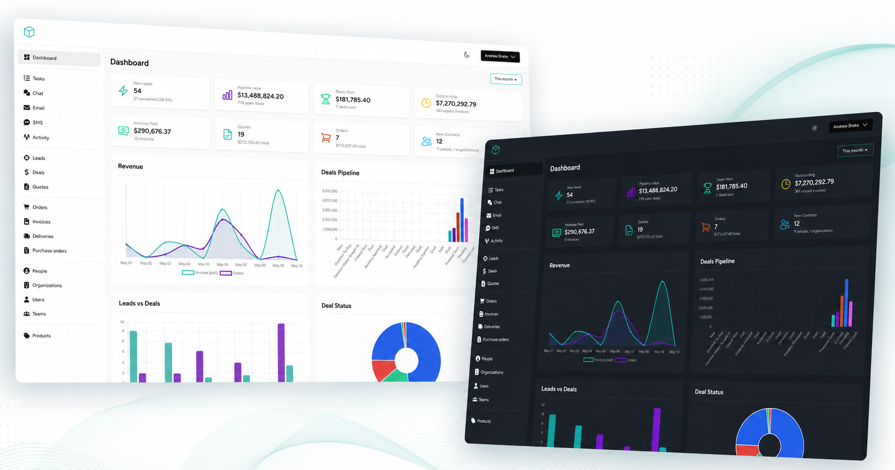

# Laravel CRM

[](https://packagist.org/packages/venturedrake/laravel-crm)
[](LICENSE.md)
[](https://packagist.org/packages/venturedrake/laravel-crm)



The free Laravel CRM you have been looking for, this package will add CRM functionality to your laravel projects or can be used as a complete standalone CRM built with Laravel. 

## Use Cases

- Use as a free CRM for your business or your clients
- Build a custom CRM for your business or your clients
- Use as an integrated CRM for your Laravel powered business (Saas, E-commerce, etc)
- Use as a CRM for your Laravel development business
- Run a multi-tenant CRM Saas business

## Features

 - Dashboard
 - Sales leads management
 - Deal management
 - Quote builder
 - Send quotes with accept/reject functionality
 - Orders & Invoicing
 - Purchase orders
 - Deliveries
 - Web / In-app Chat
 - Email marketing
 - SMS marketing
 - Kanban boards 
 - Activity Feed / Timelines
 - Custom fields
 - Customer management
 - Contact database management
 - Products & Product Categories
 - Notes & Tasks
 - File uploads
 - Users & Teams
 - Secure registration & login
 - Roles & Permissions thanks to [Spatie Permissions](https://github.com/spatie/laravel-permission)
 - Xero integration (optional — see [Optional integrations](#optional-integrations))
 - ClickSend integration

## Live Demo

[https://demo.laravelcrm.com/register](https://demo.laravelcrm.com/register)

## Official Documentation

For more information on how to use the package, please refer to the official documentation available on [https://laravelcrm.com/docs](https://laravelcrm.com/docs). The documentation provides very detailed instructions on how to install and use the package.

## Version Information

Version   | Laravel         | Status                  | PHP Version
:----------|:----------------|:------------------------|:------------
2.x       | 11.x.x - 13.x.x | Active support :rocket: | > = 8.2
1.x      | 6.x.x - 11.x.x  | End of life             | > = 7.3

## Installation

Note: This is a simple installation guide. For more detailed instructions, please refer to the official documentation available on [https://laravelcrm.com/docs](https://laravelcrm.com/docs).

#### Step 1. Install a Laravel project if you don't have one already

https://laravel.com/docs/installation

#### Step 2. Make sure you have set up authentication in your project

https://laravel.com/docs/authentication

#### Step 3. Require the current package using composer:

```bash
composer require venturedrake/laravel-crm
```

#### Step 4. Run the installer

```bash
php artisan laravelcrm:install
```

#### Step 5. Access the CRN

Navigate to http://yoursite.com/crm (or whatever you set LARAVEL_CRM_ROUTE_PREFIX to). Log in with the owner credentials you created during installation.

## Optional integrations

### Xero

The Xero integration needs a package this one only suggests:

```bash
composer require dcblogdev/laravel-xero:1.1.3
```

It is not required by default because every published version of it caps `guzzlehttp/guzzle` at `^7.9.3`, which would make this package uninstallable in any app that has moved to Guzzle 8 — including a stock Laravel 13.32+ app. Installing it holds your app on Guzzle 7 until upstream ships a Guzzle 8 release.

Without it the CRM runs normally and the Xero integration is simply inert: nothing errors, and **Settings → Integrations → Xero** tells you what to install.

## Updating

```bash
composer update venturedrake/laravel-crm   # republishes assets and clears caches
php artisan laravelcrm:update              # migrations, seed data, backfills
```

The first command is enough on its own only for code. Because the CRM ships database changes, the
second one is what applies them — `php artisan migrate` alone is not sufficient.

Two commands, because they need different permissions and run at different times:

| Command | Does | When |
| --- | --- | --- |
| `laravelcrm:upgrade` | Republishes assets, prunes stale build output, clears cached config/routes/views. **Never touches the database.** | Automatically, from your app's `post-autoload-dump` composer hook — so `composer install` on a production box does it too |
| `laravelcrm:update` | Runs `laravelcrm:upgrade`, then migrations, seeders and data backfills. Exits non-zero if any of it fails. | Explicitly, by you or your deploy script |

The installer adds the composer hook to your `composer.json` for you. **Installs from before 2.4.0
need to add it once, by hand:**

```json
"scripts": {
    "post-autoload-dump": [
        "@php artisan package:discover --ansi",
        "@php artisan laravelcrm:upgrade --ansi"
    ]
}
```

On a production deploy:

```bash
composer install --no-dev --optimize-autoloader   # the hook fires laravelcrm:upgrade
php artisan laravelcrm:update --force             # migrations + backfills, non-interactive
php artisan config:cache && php artisan route:cache && php artisan view:cache
```

See the [upgrade guide](https://laravelcrm.com/docs/2.x/upgrading) — or
[docs/upgrading.md](docs/upgrading.md) in this repo — for zero-downtime deploys, caveats, and
version-specific notes.

## Testing

``` bash
composer test
```

### Changelog

Please see [CHANGELOG](CHANGELOG.md) for more information what has changed recently.

## Roadmap

 - Documents
 - Calendar
 - CSV Import / Export
 - Payments

## Feedback

Participate in the [discord community](https://discord.gg/rygVyyGSHj)

## Contributing

Please see [CONTRIBUTING](CONTRIBUTING.md) for details.

### Security

If you discover any security related issues, please email andrew@venturedrake.com instead of using the issue tracker.

## Credits

- [Andrew Drake](https://github.com/venturedrake)
- [All Contributors](../../contributors)

## License

The MIT License (MIT). Please see [License File](LICENSE.md) for more information.